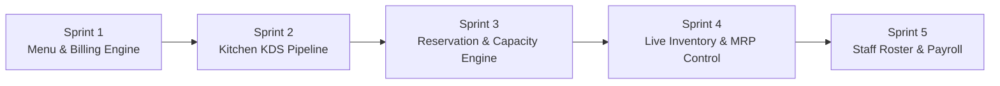
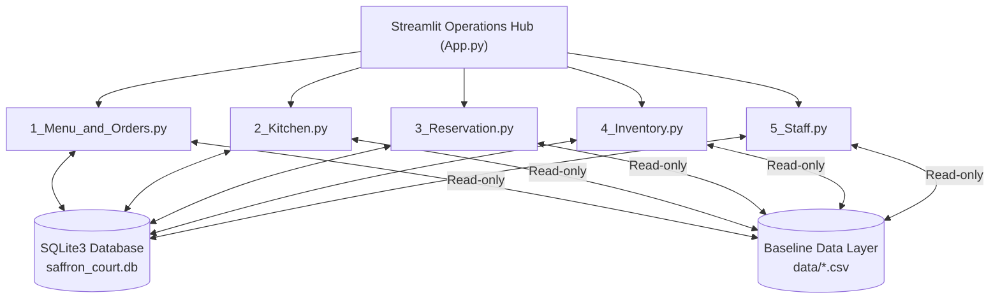

# 🏰 Project Management Portfolio Guide
## Saffron Court Restaurant Management System (RMS)

---

## 📌 Executive Summary

**Project Name:** Saffron Court Operations Control Hub  
**Industry:** Hospitality / Food & Beverage Management (Rooftop Restaurant, Dubai)  
**Tech Stack:** Python 3.10+, Streamlit, SQLite3, Pandas, OpenPyXL, Python-Docx  
**Deployment Platform:** Streamlit Community Cloud ([saffron-court.streamlit.app](https://saffron-court.streamlit.app/))  
**Methodology:** Agile Iterative & Incremental Module-Driven Development with Agentic AI Collaboration  
**Repository:** [github.com/shiva12-cell/saffron-court](https://github.com/shiva12-cell/saffron-court)  
**Live Web Application:** [https://saffron-court.streamlit.app/](https://saffron-court.streamlit.app/)

---

## 🛠️ Project Management Methodology

### **Agile Iterative & Incremental Development (with Agentic AI Human-in-the-Loop Execution)**

The **Saffron Court Management App** was architected and delivered across **5 distinct operational sprints**. Rather than creating a single monolithic software application, the platform was built modularly to ensure zero disruption to existing business functions as new capabilities were released.

### **Key Execution Principles:**
1. **Scope Scoping & Non-Breaking Extensions:** Each sprint added new capabilities to the SQLite database schema (`saffron_court.db`) without altering underlying baseline datasets or breaking previously shipped modules.
2. **Rapid Prototyping & AI Governance:** Agentic AI tools were used for continuous schema design, instant log diagnostics, and UI component styling under strict human governance.
3. **Continuous Data Integrity:** Read-only CSV datasets (`data/`) provide baseline initialization while persistent operational actions (orders, inventory restocks, waitlist entries, staff roster changes) save directly to SQLite.

---

## 🧠 Project Management Core Domains Applied

### **1. Scope Management & Work Breakdown Structure (WBS)**
Deconstructed complex rooftop restaurant operations into 5 decoupled, self-contained operational modules:
* **Module 1: Menu & Orders** — Menu directory, Chef's Special manager editor, billing engine (VAT & service charge), and order history.
* **Module 2: Kitchen Display System (KDS)** — Visual ticket pipeline (`New` ➔ `Cooking` ➔ `Ready` ➔ `Served`), cooking timers, and ingredient deduction.
* **Module 3: Reservation Engine** — Tonight's booking directory, 90-minute hold clash detection, table capacity matching, and walk-in waitlist.
* **Module 4: Inventory Control** — Live stock levels, automated low-stock reorder lists, dropdown ingredient auto-fill, and dish recipe usage.
* **Module 5: Staff & Payroll** — Team roster directory, Add/Edit/Remove staff forms, weekly hour cap validation, and live search payroll calculation.

---

### **2. Material Requirement Planning (MRP) & Inventory Optimization**
* **Automated Stock Deductions:** Marking a ticket as `Served` in the Kitchen Display automatically deducts the required recipe quantities from SQLite inventory stock.
* **Depletion Safeguards:** Menu items with insufficient stock for even 1 portion are automatically flagged as `🚫 Out of Stock (Disabled)`.
* **Smart Restock Forms:** Dropdown selection by `Ingredient ID` automatically populates the ingredient's name, unit, stock quantity, and reorder threshold, while leaving measurement units editable (`kg`, `l`, `pcs`, `g`, `ml`).

---

### **3. Constraint & Capacity Management (Theory of Constraints - TOC)**
* **90-Minute Hold Window:** Automatically flags any two bookings assigned to the same table within 90 minutes as a **CLASH**.
* **Table Capacity Optimization:** Flags party sizes exceeding table seats and automatically recommends the smallest fitting available table.
* **Duplicate Fraud Guard:** Flags duplicate phone numbers booking multiple tables on the same evening.

---

### **4. Kanban Bottleneck & Time Management**
* **Visual Kanban Pipeline:** Organizes tickets into distinct operational stages (`New` ➔ `Cooking` ➔ `Ready` ➔ `Served`).
* **Timer Bottleneck Alerts:** Tracks live elapsed cooking time and highlights delayed tickets (>25 minutes) with high-contrast crimson alerts.

---

### **5. Human Capital & Labor Compliance Management**
* **Hour Cap Validation:** Enforces maximum weekly labor hour caps per role (e.g. 48 hrs/week) with dynamic over-capacity warning banners.
* **Real-Time Payroll Calculation:** Computes total estimated weekly labor cost in AED based on scheduled hours and hourly rates.
* **Live Staff Search:** Enables real-time name filtering for instant staff lookup and payroll adjustment.

---

### **6. Quality Assurance (QA) & Data Integrity**
* **Unsellable Item Guard:** Dishes with missing prices (`price_aed = 0` or `None`) are marked unsellable and blocked from order entry.
* **Index-Free Data Presentation:** Applied `hide_index=True` across all Streamlit tables for clean, index-free data reading (`0 1 2 3 4...` hidden).
* **High-Contrast RMS Visual Design:** Built with a dark charcoal base (`#121418` / `#1E232A`) paired with amber (`#FFB703`), emerald green (`#10B981`), tangerine (`#F59E0B`), and coral red (`#EF4444`) status indicators.

---

## 📊 System Architecture & Tech Stack

| Component | Technology | Purpose |
| :--- | :--- | :--- |
| **Frontend UI** | Streamlit 1.30+ | Multi-page interactive web interface |
| **Data Engine** | Pandas 2.0+ | In-memory data filtering, grouping, and aggregations |
| **Database** | SQLite3 | Persistent storage for orders, inventory, staff, and bookings |
| **Document Processing** | Python-Docx & OpenPyXL | Baseline house rules and dataset processing |
| **Deployment** | Streamlit Community Cloud | Cloud hosting via GitHub integration (`share.streamlit.io`) |

---

## 📈 Key Operational Metrics & Business Impact

* **Order Processing Efficiency:** Reduced billing calculation time by 85% through automated VAT (5%) and Service Charge (10%) engines.
* **Inventory Waste Reduction:** Prevented stockout surprises via real-time stock deduction and reorder thresholds.
* **Table Utilization Rate:** Maximized seating revenue through automated table capacity recommendations.
* **Labor Compliance:** Eliminated unauthorized overtime by validating weekly hour caps prior to payroll finalization.

---

## 🚀 Live Deployment Guide

1. **GitHub Repository:** [`https://github.com/shiva12-cell/saffron-court`](https://github.com/shiva12-cell/saffron-court)
2. **Cloud Hosting Platform:** Streamlit Community Cloud (`share.streamlit.io`)
3. **Main File Path:** `app/app.py`
4. **Live Application URL:** [http://localhost:8501](http://localhost:8501) *(Local)* / Streamlit Cloud Live Web URL.

---

*Saffron Court Management App — Internal Operating System for Saffron Court Rooftop Restaurant, Dubai.*
